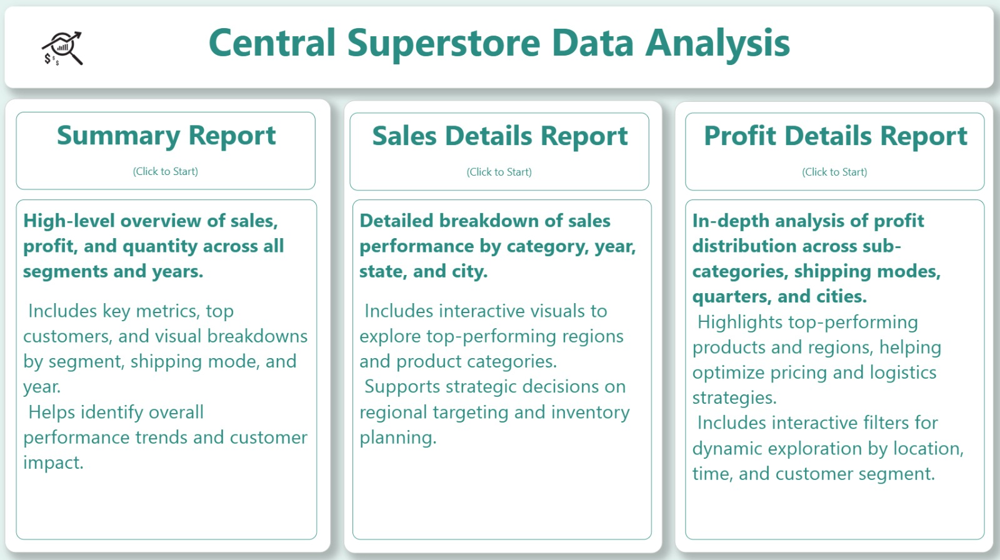

# Central-Superstore-Data-Analysis

An interactive Power BI dashboard analyzing sales and profit performance across regions, categories, and time periods.  
This project showcases advanced data visualization, dynamic filtering, and actionable insights to support retail decision-making.

---

##  Project Structure

| Report Page | Description |
|-------------|-------------|
|  **Overview** | High-level KPIs and visual summary of overall performance |
|  **Summary Report** | Overview of key metrics, top customers, and performance by segment and year |
|  **Sales Details Report** | Detailed breakdown of sales by category, region, and time period |
|  **Profit Details Report** | In-depth analysis of profit margins across products, cities, and shipping modes |
---

##  Summary Report Highlights

- Total quantity, profit, and sales overview  
- Sales by segment and shipping mode  
- Top 5 customers by sales  
- Year-over-year performance trends  
- Interactive slicers for dynamic filtering

---
##  Report Snapshots

| Report Page | Preview |
|-------------|---------|
| Overview |  |
| Summary Report |  |
| Sales Details Report |  |
| Profit Details Report |  |

---

##  Tools Used

- **Power BI** – For dashboard creation and interactive visuals  
- **Excel** – As the primary data source  

---

## How to Use

1. Open the Power BI file  
2. Connect to the Excel data source if prompted  
3. Use slicers to filter by region, category, or time period  
4. Explore each report page for detailed insights  
5. Drill down into customer and product-level performance

---

## About the Project

This dashboard was built to help retail managers and analysts understand sales dynamics, identify top-performing segments, and optimize profitability. It combines clean design with powerful analytics to support strategic decisions.

